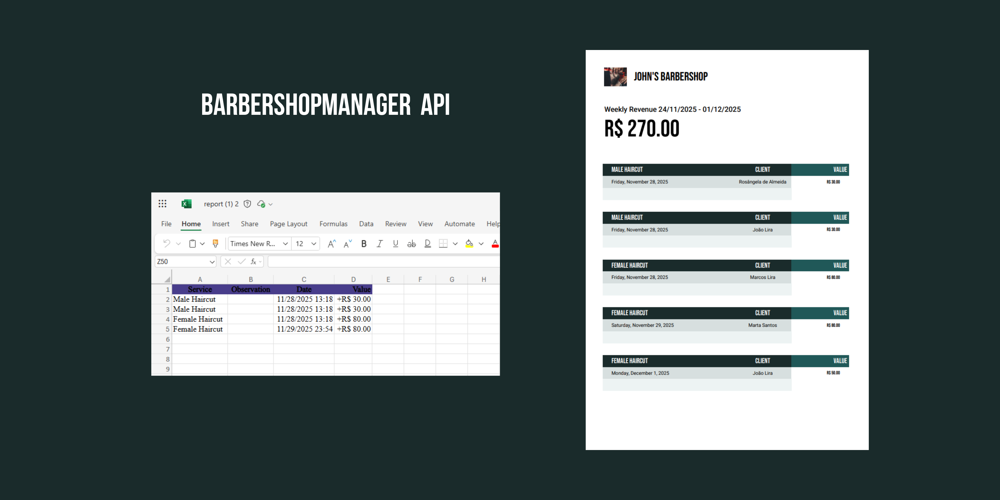

# 💈 BarberShopManager — API

A BarberShopManager API é uma aplicação construída em .NET Core, seguindo padrões modernos de arquitetura e boas práticas para garantir escalabilidade, organização e facilidade na manutenção.
Ela engloba desde o cadastro de clientes e serviços até geração de relatórios (PDF/Excel) e validações



<br>

## Stack

- **.NET Core / ASP.NET Core**
- **Entity Framework Core (MySQL)**
- **MySQL Server + MySQL Workbench**
- **Swagger (OpenAPI)**
- **Injeção de Dependência nativa do .NET**

<br>

## 📦 NuGet Packages

### **Core**
- AutoMapper
- FluentValidation
- Pomelo.EntityFrameworkCore.MySql
- MigraDoc (PDF)
- ClosedXML (Excel)


### **Testes**
- xUnit
- FluentAssertions
- Bogus

<br>

## 🔧 Funcionalidades Principais

- **Gerenciamento de Clientes**
- **Gerenciamento de Serviços da Barbearia**
- **Validações com FluentValidation**
- **Mapeamento com AutoMapper**
- **Filtro exceção**
- **Middleware para Idiomas**
- **Localização de mensagens com arquivo Resource**
- **Geração de Relatórios**
- **PDF com MigraDoc**
- **Excel com ClosedXML**
- **Armazenamento em MySQL**
- **Testes unitários com xUnit + FluentAssertions**

<br>

## 📄 Documentação

Após iniciar o projeto, acesse o Swagger. Lá você encontrará:

- Todas as rotas da API
- Exemplos de requisição
- Códigos de resposta HTTP

<br>

## 🧪 Testes


O projeto inclui testes para:
- Validadores
- Lógicas isoladas
- Comunicação entre camadas (quando aplicável)


Ferramentas:
- xUnit
- FluentAssertions
- Bogus

<br>

## 🏗️ Arquitetura da Solução


A solução é organizada em múltiplos projetos, com responsabilidades bem separadas:


```
src/
├── BarberShopManager.API
│ ├── Controllers
│ ├── Middleware
│ ├── Filters (Exception Filter)
│
├── BarberShopManager.Application
│ ├── AutoMapper
│ ├── UseCases
│ ├── Validators
│
├── BarberShopManager.Communication
│ ├── Clients
│ ├── Services
│ └── Exceptions
│
├── BarberShopManager.Domain
│ ├── Entities
│ ├── Reports
│ └── Repositories
│
├── BarberShopManager.Exceptions
│ └── Exceptions customizadas
│
└── BarberShopManager.Infrastructure
├── DataAccess (EF Core)
└── DependencyInjectionExtension.cs


tests/
├── CommonTestUtilities
└── Validators.Test
```

<br>

## ▶ Como Executar


1. **Clone o repositório**
```bash
git clone https://github.com/joaolira12/Barbershop-Manager.git
```


2. **Configure o appsettings.Development.json ou appsettings.json**
```json
"ConnectionStrings": {
"Connection": "server=localhost;user=root;password=suasenha;database=barbershop;"
}
```

3. **Execute a API**


---


